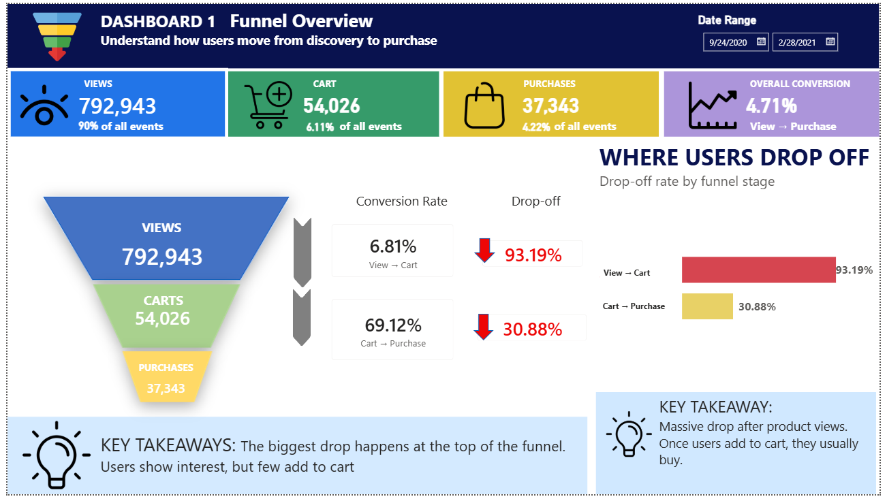
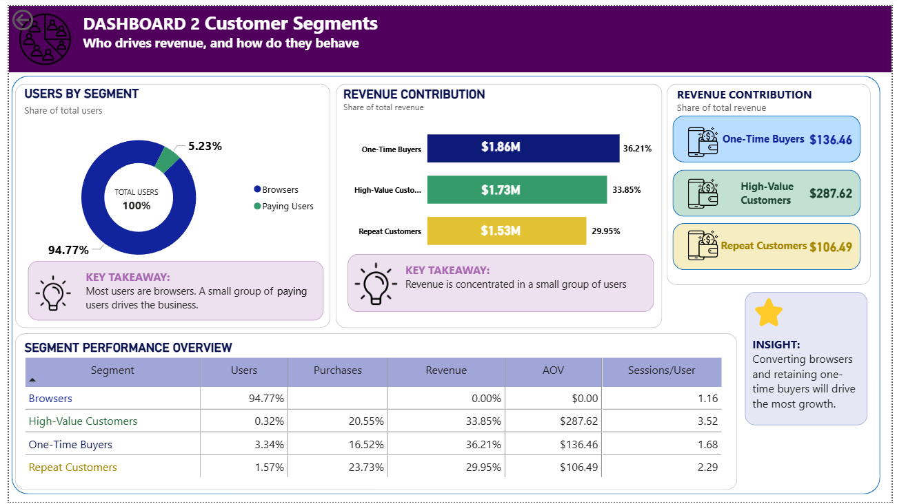
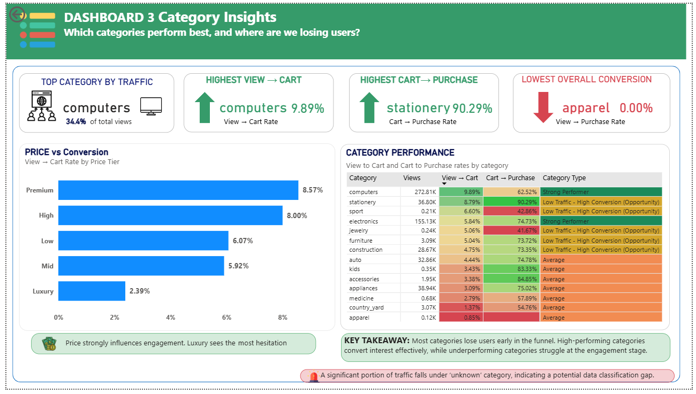
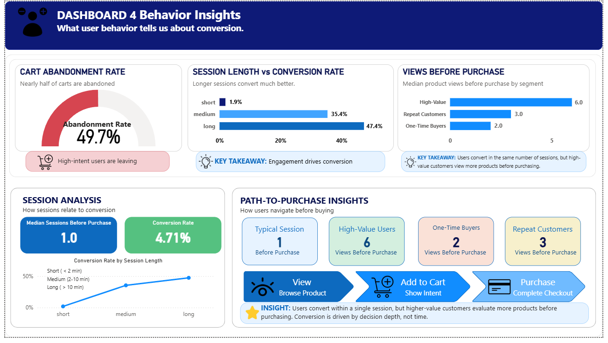

# E-Commerce Customer Behavior & Conversion Analysis  

## Overview  
This project analyzes user behavior in an e-commerce platform to identify conversion bottlenecks, customer segments, and revenue opportunities. The analysis follows an end-to-end workflow using Snowflake for data transformation and Power BI for visualization, simulating a real-world analytics pipeline.

---

## Objective  
- Identify where users drop off in the funnel  
- Understand customer behavior and segmentation  
- Evaluate category and pricing performance  
- Provide actionable recommendations to improve conversion and revenue  

---

## Dataset  
- Event-level transactional data  
- ~885,000 records  
- Time range: Sep 2020 – Feb 2021  
- Each row represents a user interaction (view, cart, purchase)  

---

## Data Architecture  
Raw Event Data
↓
Snowflake (SQL Transformation)
↓
Analysis-Ready Dataset (View)
↓
Power BI Dashboard

---

## Data Preparation  

- Converted timestamps for time-based analysis  
- Removed duplicate records using window functions  
- Handled missing values:
  - ~27% missing category  
  - ~24% missing brand  
- Standardized categorical fields  
- Created derived features:
  - price buckets  
  - customer segments  
  - session-level metrics  

---

## Key Insights  

### Funnel Analysis  
- 90% views → 6.11% carts → 4.22% purchases  
- Major drop-off at the view to cart stage  
- Cart to purchase conversion is strong (~69%)  

Insight:  
The main issue is user engagement, not checkout.

---

### Customer Segmentation  
- ~95% of users are non-buyers  
- Revenue is driven by:
  - One-time buyers  
  - High-value customers  
  - Repeat customers  

Insight:  
Revenue is concentrated among a small group of users.

---

### Category & Price Insights  
- Strong performance: computers, electronics  
- Weak performance: apparel, appliances  
- Low-priced items convert best  
- Luxury items have the lowest conversion  

Insight:  
Conversion is influenced by price and product positioning.

---

### Behavioral Insights  

Cart Abandonment:
- ~50% of users abandon after adding to cart  

Session Behavior:
- Short sessions: 1.94% conversion  
- Long sessions: 47.40% conversion  

Insight:  
Conversion increases with engagement depth.

---

## Dashboard  

### Funnel Overview  

### Customer Segmentation  

### Category & Price Insights  

### Behavioral Insights  

---

## Recommendations  

- Improve product pages (images, descriptions, reviews)  
- Enhance product discovery and recommendations  
- Optimize pricing (discounts, bundling, financing)  
- Reduce decision friction (comparison tools, clarity)  
- Recover abandoned carts via retargeting  
- Focus on converting low-intent users  
- Strengthen retention strategies  

---

## Technical Approach  

- Built SQL transformation pipelines using CTEs in Snowflake  
- Created analysis-ready datasets using views  
- Designed structured data model for reporting  
- Developed interactive dashboards in Power BI  

---

## Tech Stack  

- Data Warehouse: Snowflake  
- Query Language: SQL  
- Visualization: Power BI  
- Data Modeling: Star schema  

---

## Key Takeaway  

Conversion is not a checkout problem — it is a decision-making problem at the top of the funnel.

---

## How to Use  

1. Review SQL scripts in `/sql`  
2. Open Power BI dashboard file (`.pbix`)  
3. Explore dashboards and insights  
